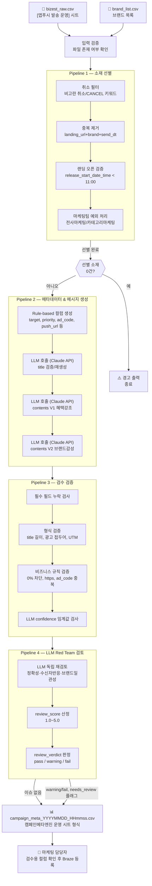
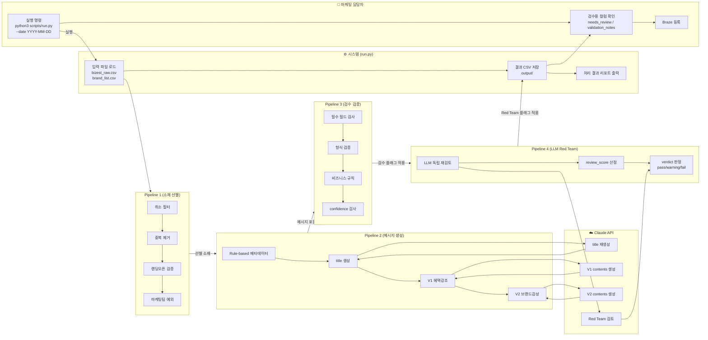

# 앱푸시 캠페인 소재 자동화 시스템 — 플로우 개요

> 대상 독자: 마케팅팀 운영 담당자
> 마지막 수정: 2026-04-24

---

## 1. 시스템 목적

[앱푸시 발송 운영] 시트(비제스트 RAW)에 등록된 소재 요청을 받아,
담당자가 Braze에 직접 등록할 수 있는 **캠페인메타엔진 운영 시트 형식 CSV**를 자동 생성합니다.

| 구분 | 내용 |
|------|------|
| 입력 | [앱푸시 발송 운영] 시트 다운로드 CSV (`bizest_raw.csv`) |
| 출력 | 캠페인메타엔진 운영 시트 형식 CSV (`output/campaign_meta_YYYYMMDD_HHmmss.csv`) |
| 역할 범위 | 소재 선별 → 메타데이터 생성 → LLM 메시지 생성 → 검수 플래그 |
| 역할 외 | Braze 발송 (담당자가 직접 시트 확인 후 등록) |

---

## 2. 데이터 플로우 다이어그램



---

## 3. 수영레인 다이어그램 (역할별 플로우)



---

## 4. 파이프라인 상세

### Pipeline 1 — 소재 선별

비제스트 RAW에서 발송 가능한 소재만 추출합니다.

| 단계 | 조건 | 처리 |
|------|------|------|
| ① 취소 필터 | 비고란(`remarks`)에 `취소`, `CANCEL`, `cancel` 포함 | 제외 |
| ② 중복 제거 | `landing_url + sourceBrandId + send_dt` 조합 중복 | ID 오름차순 첫 번째만 유지 |
| ③ 랜딩 오픈 검증 | `release_start_date_time < send_dt 11:00` 미충족 | 제외 |
| ④ 마케팅팀 예외 | `register_team_name`에 `전사마케팅` 또는 `카테고리마케팅` 포함 | ③ 조건 무관하게 선별 |

**중간 저장:** `data/pipeline1_output_YYYYMMDD.csv`

---

### Pipeline 2 — 메타데이터 & 메시지 생성

선별된 소재에 대해 캠페인메타엔진 운영 시트의 컬럼을 채웁니다.

#### Rule-based 컬럼

| 컬럼 | 생성 방식 |
|------|----------|
| `send_dt` | `--date` 인수 또는 내일 날짜 자동 사용 |
| `send_time` | 고정 `11:00` |
| `target` | 팀명 기반 성별: 여성팀→`여성`, 남성팀→`남성`, 그 외→`전체` |
| `priority` | 전사마케팅→`1`, 카테고리마케팅→`2`, 그 외→`3` |
| `ad_code` | `APSCMCD` + BASE36 순번 (이전 코드에서 +1 채번) |
| `content_type` | URL 패턴: `/campaign/`→`캠페인`, `/content/`→`콘텐츠` |
| `brand_id` | `sourceBrandId` 직접 복사 |
| `category_id` | 팀명 → 카테고리 코드 매핑 테이블 |
| `landing_url` | RAW 직접 복사 |
| `image_url` | RAW `img_url` 직접 복사 |
| `push_url` | `landing_url?utm_source=app_push&utm_medium=cr&utm_campaign={ad_code}` |

#### LLM 생성 컬럼

| 컬럼 | 조건 | 규격 |
|------|------|------|
| `title` | `main_title`이 15~40자 + 브랜드/혜택 키워드 포함 → 원본 사용, 그 외 → LLM 재생성 | 15~40자, 명사형 종결 |
| `contents` (V1 혜택강조) | 모든 선별 소재 | `(광고) ` 시작, 40~60자, 혜택 수치 강조 |
| `[검수용] contents_v2` (V2 브랜드감성) | 모든 선별 소재 | `(광고) ` 시작, 25~45자, 브랜드/감성 |

> V1이 `contents`(기본값), V2는 `[검수용] contents_v2`로 병기. 담당자가 최종 선택.

---

### Pipeline 3 — 검수 검증 (Validation QA)

발송 전 문제가 될 수 있는 항목을 객관적으로 검증합니다. **행을 제거하지 않고** `[검수용]` 컬럼에 이슈를 기록합니다.

| # | 검증 항목 | 이슈 코드 | 수준 |
|---|----------|----------|------|
| 1 | 필수 필드 누락 (title, contents, landing_url, ad_code) | `*_missing` | ⛔ 오류 |
| 2 | title 길이 범위 (15~40자) | `title_length_N chars` | ⚠️ 검수 |
| 3 | `(광고)` 접두어 누락 | `missing_(광고)_prefix` | ⚠️ 검수 |
| 4 | 수신거부 문구 누락 | `missing_unsubscribe_text` | ⚠️ 검수 |
| 5 | push_url UTM 파라미터 누락 | `push_url_missing_utm` | ⚠️ 검수 |
| 6 | push_url UTM campaign ≠ ad_code | `push_url_campaign_mismatch` | ⚠️ 검수 |
| 7 | contents에 0% 표기 (최소 5% 이상 규칙) | `zero_percent_in_contents` | ⚠️ 검수 |
| 8 | landing_url https 미적용 | `landing_url_not_https` | ⚠️ 검수 |
| 9 | ad_code 중복 | `ad_code_duplicate` | ⚠️ 검수 |
| 10 | brand_id 누락 | `brand_id_missing` | ⛔ 오류 |
| 11 | LLM confidence 임계값 미달 (기준: 3.0) | `low_confidence_v1/v2(N)` | ⚠️ 검수 |
| 12 | title LLM 생성 실패(fallback) | `title_source_fallback` | ⚠️ 검수 |

**출력 컬럼:**
- `[검수용] error_flag` : ⛔ 오류 수준 이슈 존재 시 `True`
- `[검수용] needs_review` : ⚠️ 검수 또는 오류 이슈 존재 시 `True`
- `[검수용] validation_notes` : 발견된 이슈 코드 목록 (쉼표 구분)

---

### Pipeline 4 — LLM Red Team 검토

생성 규칙과 독립된 관점에서 LLM이 소재를 재검토합니다. **행을 제거하지 않고** `[검수용]` 컬럼에 결과를 기록합니다.

| 평가 기준 | 내용 |
|----------|------|
| 정확성 | 혜택 수치·조건이 promotion_content와 일치하는지 |
| 수신자 반응 | 클릭 유도력, 명확성, 과장 표현 여부 |
| 브랜드 일관성 | 브랜드 톤앤매너 적합성 |
| 차별성 | 유사 소재 대비 메시지 차별화 수준 |
| 문제 여부 | 허위·과장 광고, 금칙어, 규제 위반 가능성 |

**출력 컬럼:**
- `[검수용] review_score` : 종합 평점 (1.0~5.0)
- `[검수용] review_verdict` : `pass` (≥3.5) / `warning` (2.5~3.4) / `fail` (≤2.4)
- `[검수용] review_notes` : 검토 의견 요약
- `[검수용] review_issues` : 발견된 이슈 목록

warning/fail 판정 시 `[검수용] needs_review` 플래그를 `True`로 상향합니다.

---

## 5. 출력 파일 구조

```
output/
└── campaign_meta_YYYYMMDD_HHmmss.csv
```

### 출력 컬럼 (캠페인메타엔진 운영 시트 형식)

| 컬럼 | 내용 | 자동 생성 |
|------|------|:--------:|
| `send_dt` | 발송일 (YYYY-MM-DD) | ✅ |
| `send_time` | 발송 시각 (고정: 11:00) | ✅ |
| `target` | 발송 대상 (여성/남성/전체) | ✅ |
| `priority` | 우선순위 (1/2/3) | ✅ |
| `ad_code` | 광고 코드 (APSCMCD + BASE36) | ✅ |
| `content_type` | 콘텐츠 유형 (캠페인/콘텐츠) | ✅ |
| `goods_id` | 상품 ID | — 공란 |
| `category_id` | 카테고리 코드 | ✅ |
| `brand_id` | 브랜드 ID | ✅ |
| `team_id` | 팀 ID | — 공란 |
| `braze_campaign_name` | Braze 캠페인명 | — 공란 |
| `title` | 푸시 제목 (15~40자) | ✅ |
| `contents` | 푸시 본문 V1 혜택강조 | ✅ LLM |
| `landing_url` | 랜딩 URL | ✅ |
| `image_url` | 이미지 URL | ✅ |
| `push_url` | UTM 포함 푸시 URL | ✅ |
| `feed_url` | 피드 URL | — 공란 |
| `webhook_contents` | 웹훅 내용 | — 공란 |
| `stopped` | 중단 여부 | — 공란 |
| `[검수용] contents_v2` | 푸시 본문 V2 브랜드감성 | ✅ LLM |
| `[검수용] title_source` | title 출처 (original/llm/fallback) | ✅ |
| `[검수용] confidence_v1` | V1 LLM 신뢰도 (1~5) | ✅ |
| `[검수용] confidence_v2` | V2 LLM 신뢰도 (1~5) | ✅ |
| `[검수용] error_flag` | 오류 여부 | ✅ |
| `[검수용] needs_review` | 검수 필요 여부 | ✅ |
| `[검수용] validation_notes` | 검증 이슈 상세 | ✅ |

---

## 6. 실행 방법

### 사전 준비 (최초 1회)

```bash
# 1. 디렉터리 이동
cd match-push-agent-system

# 2. .env 파일 생성 (.env.example 복사)
cp .env.example .env
# → .env 파일을 열어 ANTHROPIC_API_KEY 입력

# 3. 패키지 설치
pip3 install -r requirements.txt
```

### 매일 실행

```bash
# 내일 날짜 자동으로 실행 (기본값)
python3 scripts/run.py

# 발송일 지정
python3 scripts/run.py --date 2026-05-01

# 입력 파일 직접 지정
python3 scripts/run.py --date 2026-05-01 --input input/my_raw.csv
```

### 단계별 실행

```bash
# Pipeline 1만 (소재 선별)
python3 scripts/run.py --stage pipeline1 --date 2026-05-01

# Pipeline 2만 (메시지 생성, Pipeline 1 결과 필요)
python3 scripts/run.py --stage pipeline2 --date 2026-05-01

# Pipeline 3만 (검수 검증, Pipeline 1 결과 필요)
python3 scripts/run.py --stage pipeline3 --date 2026-05-01

# 전체 (기본값)
python3 scripts/run.py --stage all --date 2026-05-01
```

### 입력 파일 업데이트

매 실행 전 최신 파일로 교체:

```
match-push-agent-system/
└── input/
    ├── bizest_raw.csv     ← [앱푸시 발송 운영] 시트 다운로드
    └── brand_list.csv     ← 브랜드 목록 (변경 시만 교체)
```

---

## 7. 실행 결과 리포트 예시

```
============================================================
[push-campaign 완료] send_dt=2026-05-01
============================================================

📊 처리 결과:
  선별 소재:      29건
  LLM 생성 성공: 29건
  오류:           0건
  검수 필요:      3건

📁 산출물:
  output/campaign_meta_20260501_143022.csv

⚠️  검수 필요 항목 (id): [1023, 1045, 1089]
============================================================
```

---

## 8. 검수 가이드

### 확인 순서

1. `[검수용] error_flag = True` 행 우선 확인 → 내용이 누락되었으므로 수동 작성 필요
2. `[검수용] needs_review = True` 행 확인 → `[검수용] validation_notes` 내용 검토
3. `[검수용] contents_v2` 확인 → V1과 비교 후 더 나은 문구 `contents` 컬럼에 수동 복사

### 자주 나오는 이슈 코드

| 이슈 코드 | 원인 | 조치 |
|----------|------|------|
| `title_missing` | LLM API 오류로 제목 생성 실패 | 수동 제목 작성 |
| `title_length_N chars` | LLM이 범위 밖 제목 생성 | 직접 수정 또는 삭제 |
| `zero_percent_in_contents` | 할인율 0% 표기 | 내용 수정 또는 행 제외 |
| `low_confidence_v1(N)` | LLM 신뢰도 낮음 | 문구 직접 검토 및 수정 |
| `title_source_fallback` | 원본과 LLM 제목 모두 부적합 | 제목 수동 작성 |

---

## 9. 디렉터리 구조

```
match-push-agent-system/
├── CLAUDE.md                          # 에이전트 오케스트레이터 설명
├── .env                               # API 키 (git 제외)
├── .env.example                       # API 키 예시
├── requirements.txt                   # Python 의존성
├── input/                             # 입력 파일
│   ├── bizest_raw.csv                 # [앱푸시 발송 운영] 시트
│   ├── brand_list.csv                 # 브랜드 목록
│   ├── category_selector.csv          # 카테고리 코드
│   └── ad_code_seed.txt               # 마지막 광고코드 (자동 관리)
├── output/                            # 산출물 (자동 생성)
│   └── campaign_meta_YYYYMMDD_*.csv
├── data/                              # 중간 데이터 (자동 생성)
│   └── pipeline1_output_YYYYMMDD.csv
├── docs/                              # 문서
│   ├── flow_overview.md               # 이 문서
│   └── flow_overview.html             # HTML 버전
├── scripts/                           # Python 스크립트
│   ├── run.py                         # 메인 실행
│   ├── config.py                      # 설정 및 상수
│   ├── pipeline1.py                   # 소재 선별
│   ├── pipeline2.py                   # 메시지 생성
│   ├── pipeline3.py                   # 검수 검증
│   ├── rules.py                       # Rule-based 로직
│   ├── prompts.py                     # LLM 프롬프트
│   └── llm_client.py                  # Claude API 클라이언트
└── references/                        # 정책 문서
    ├── selection_policy.md
    ├── message_policy.md
    └── brand_guidelines.md
```

---

## 10. 향후 확장 계획

| 단계 | 내용 | 예정 |
|------|------|------|
| Phase 2 | Google Spreadsheet API 연동 (파일 업로드 → 자동 읽기/쓰기) | 미정 |
| Phase 2 | Databricks Workflow 자동화 (수동 실행 → 스케줄 실행) | 미정 |
| Phase 3 | Slack 검수 알림 자동화 | 미정 |
| Phase 3 | 성과 데이터 피드백 → RAG 기반 메시지 개선 | 미정 |
